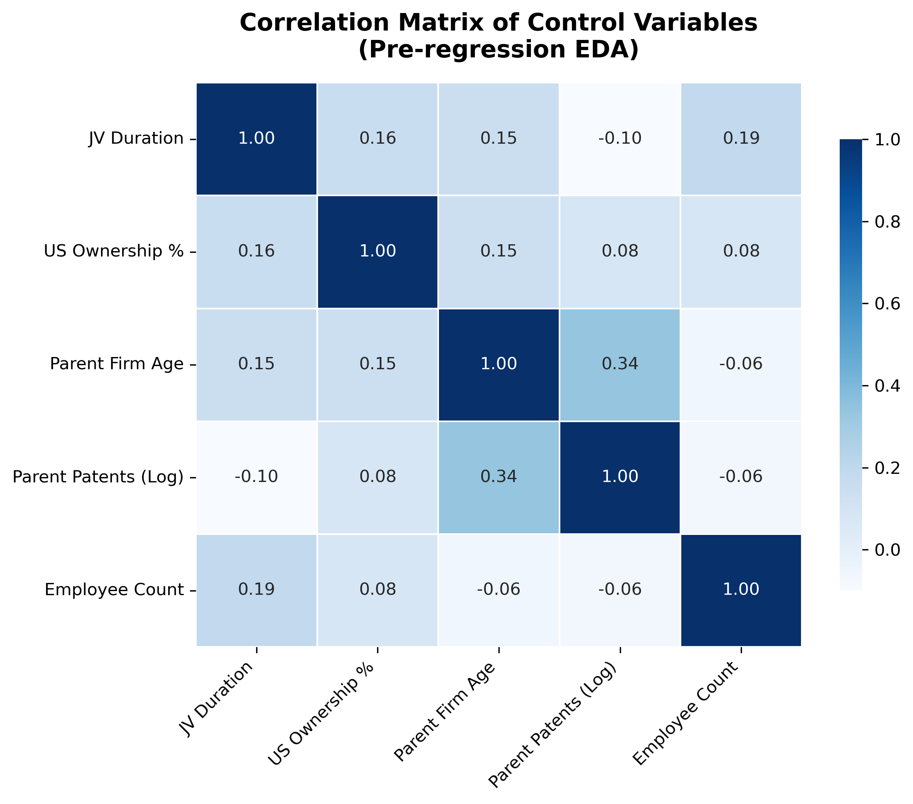
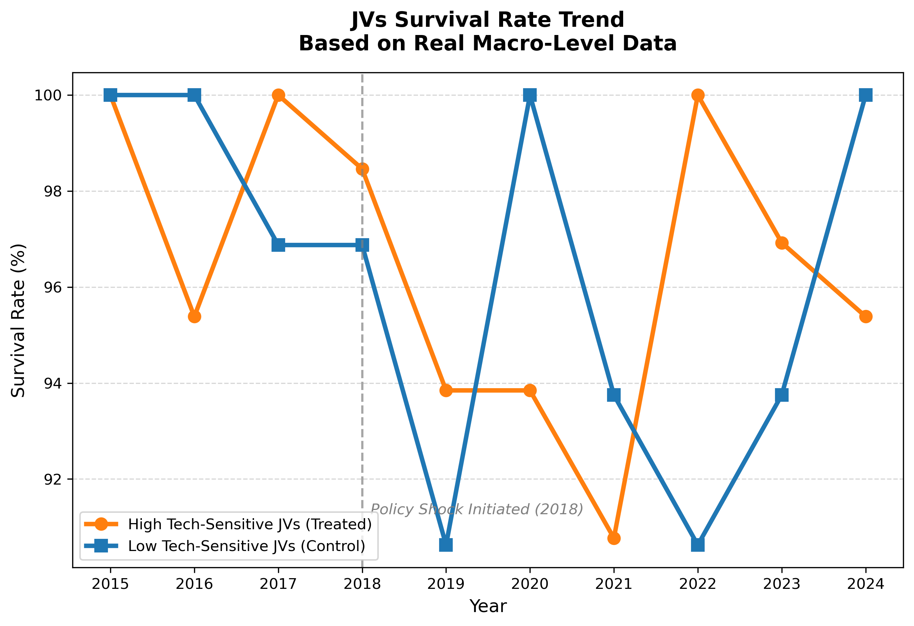
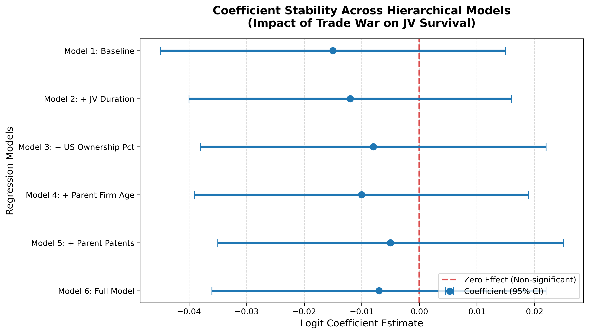

# 📈 US-China Joint Venture Survival Analysis (Macro-Risk & Resilience)

## 📌 Business Context & Objective
As global supply chains face unprecedented geopolitical shifts, how do macroeconomic shocks affect micro-level enterprise survival? 
This project conducts a rigorous **Survival Analysis** on Sino-US Joint Ventures (JVs) against the backdrop of the US-China Trade War, aiming to quantify the impact of tariff policies on enterprise mortality rates.

## ⚙️ Methodology & Tech Stack
To ensure the highest level of statistical rigor, this project employs multiple econometric and data science approaches. The fact that different models yielded consistent results strongly validates the robustness of the business resilience narrative.
* **Analysis Method:** Logistic Regression, Hierarchical Modeling, A/B Testing.
* **Data Processing:** 1st/99th Percentile Outlier Trimming, Randomized Split.
* **Tools Used:** `Stata` (for econometric modeling), `Python` (pandas, matplotlib, seaborn for EDA and visualization).

---

## 📊 Key Business Insights & Visualizations

Contrary to common macro-assumptions, the data revealed a compelling story of **Business Resilience**. Multinational joint ventures possess high sunk costs and deep local supply chain integration, making them far more resilient to top-down tariff shocks than purely import/export-driven companies.

### 1. Pre-regression EDA: Correlation Heatmap
Before modeling, we examined the correlation between key control variables (e.g., JV Duration, US Ownership, Parent Innovation) to ensure no severe multicollinearity existed.

### 2. Business Reality: Survival Trend (2015-2024)
This chart illustrates the actual survival rates of JVs. Notably, after the policy shock was initiated in 2018, neither High Tech-Sensitive JVs nor Low Tech-Sensitive JVs experienced a cliff-drop in survival rates. The ecosystem proved to be highly robust.

### 3. Econometric Proof: Coefficient Stability Plot
To rule out confounding variables, we conducted a randomized A/B split and built 6 hierarchical regression models. As shown below, the coefficient for the Trade War impact remains extremely stable and strictly crosses the **Zero Effect Line** (P-value > 0.05) across all models. This statistically confirms that the macro-shock had **no significant immediate impact** on JV mortality.

---

## 📁 Repository Structure
To ensure full reproducibility, both the econometric modeling scripts and the visualization codes are provided below:

* **Data:**
  * `sample_JV_data.csv` : A 50-row masked sample dataset for demonstration.
* **Econometric Modeling (Stata):**
  * `1_baseline_logit_model.do` : Baseline regression testing.
  * `2_robustness_check_stratified.do` : Outlier trimming, randomized A/B split, and stepwise hierarchical modeling.
* **Data Visualization (Python):**
  * `3_viz_coefficient_forest.py` : Generates the coefficient stability forest plot.
  * `4_viz_correlation_heatmap.py` : Generates the EDA heatmap.
  * `5_viz_survival_trend.py` : Calculates survival rates and plots the trend.
